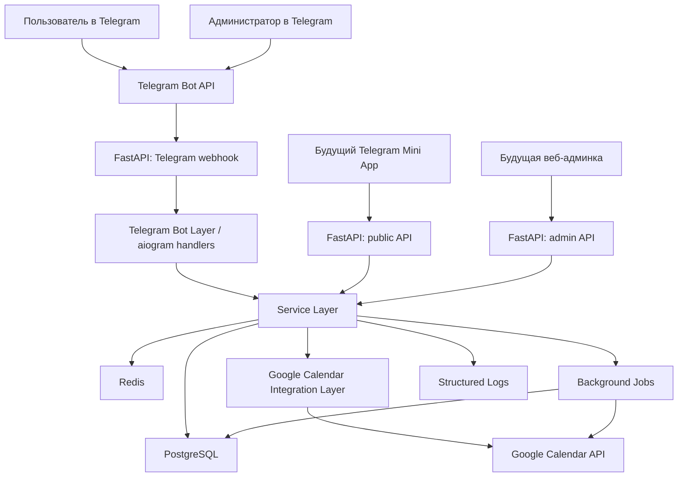
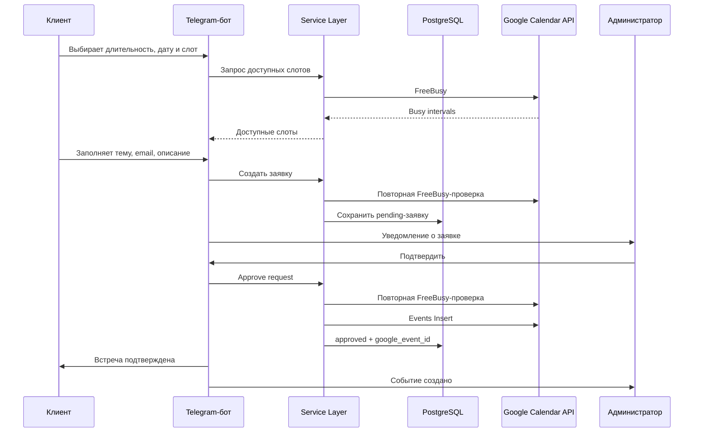

# Этапы разработки, технологии и архитектура Telegram-бота для согласования встреч

Дата: 18.06.2026
Статус документа: подготовительный, для согласования до начала разработки
Основание: `TZ_Telegram_bot_Google_Calendar.md`

## 1. Цель документа

Этот документ нужен, чтобы до написания кода согласовать:

- какие технологии используем;
- как будет устроена архитектура;
- в каком порядке разрабатывать MVP;
- что должно появиться на каждом этапе;
- как проверять результат каждого этапа;
- какие логи обязательно добавлять, чтобы быстро находить и исправлять проблемы.

Код на этом этапе не пишем. Документ фиксирует план и технические решения.

## 2. Короткое резюме решения

Рекомендуемая архитектура: один backend-сервис на Python, который одновременно обслуживает Telegram webhook, Google OAuth callback, внутренний API для будущего Mini App и веб-админки. Бизнес-логика должна жить в сервисном слое, а не внутри Telegram-сценариев. Это позволит сначала сделать чат-бота, а затем добавить Mini App без переписывания ядра.

Рекомендуемый стек:

- Python 3.12+;
- FastAPI;
- aiogram 3.x;
- PostgreSQL;
- Redis;
- SQLAlchemy 2.x;
- Alembic;
- Pydantic / pydantic-settings;
- pytest;
- Docker Compose;
- Google Calendar API;
- Telegram Bot API.

## 3. Технологии для согласования

### 3.1. Backend

Решение: Python 3.12+ и FastAPI.

Почему:

- подходит для API, webhook и OAuth callback;
- хорошо работает с асинхронным кодом;
- дает автодокументацию API, которая пригодится для будущего Mini App;
- проще поддерживать один backend для бота, админки и будущего frontend.

Что согласовать:

- принимаем Python/FastAPI как основной backend-стек;
- не используем Node.js/NestJS на MVP, чтобы не дробить проект.

### 3.2. Telegram-бот

Решение: aiogram 3.x.

Почему:

- современный асинхронный фреймворк для Telegram Bot API;
- хорошо подходит для webhook, inline-кнопок и сценариев с состояниями;
- совместим с Python backend.

Что согласовать:

- бот работает через webhook в production;
- long polling допускается только локально для разработки;
- все тексты пользователя хранятся централизованно, чтобы их было удобно менять.

### 3.3. Google Calendar integration

Решение: Google Calendar API через OAuth 2.0 владельца календаря.

Используем:

- FreeBusy для проверки занятости;
- Events Insert для создания встречи;
- attendees для добавления клиента по email;
- OAuth refresh token для долгосрочного доступа;
- push notifications оставить как будущий этап, не делать обязательными в MVP.

Что согласовать:

- клиенту не нужно авторизоваться в Google, он только вводит email;
- владелец календаря один раз подключает свой Google Calendar;
- встреча создается только после ручного подтверждения администратором.

### 3.4. База данных

Решение: PostgreSQL.

Почему:

- надежно хранит заявки, пользователей, настройки и audit log;
- поддерживает транзакции и индексы;
- подходит для будущего роста проекта.

ORM и миграции:

- SQLAlchemy 2.x;
- Alembic для изменения схемы БД через миграции.

Что согласовать:

- основная БД - PostgreSQL;
- SQLite не использовать как основную БД, можно только для отдельных локальных тестов.

### 3.5. Redis

Решение: Redis для кеша, rate limiting и временных состояний.

Используем для:

- ограничения частоты действий пользователя;
- кеширования свободных слотов на короткое время;
- временных пользовательских состояний, если это будет удобнее, чем хранить все в PostgreSQL;
- фоновых задач, если выбранный job-runner использует Redis.

Что согласовать:

- Redis нужен не для постоянного хранения важных данных, а для временных и технических задач.

### 3.6. Фоновые задачи

Решение для MVP: APScheduler или arq/RQ.

Рекомендация:

- если MVP простой, начать с APScheduler внутри backend-сервиса;
- если будет отдельный worker, использовать arq или RQ с Redis.

Задачи:

- очистка просроченных pending-заявок;
- повторные попытки при временных ошибках Google API;
- напоминания, если они будут включены позже;
- обновление Google watch-каналов, если push notifications появятся в будущем.

Что согласовать:

- для MVP не усложнять Celery, если нет тяжелых очередей;
- заложить интерфейс фоновых задач так, чтобы позже можно было перейти на отдельный worker.

### 3.7. Конфигурация и секреты

Решение:

- pydantic-settings для чтения переменных окружения;
- `.env` только локально;
- в production секреты задаются через окружение хостинга или secret storage.

Секреты:

- Telegram bot token;
- Google client id;
- Google client secret;
- Google refresh token;
- ключ шифрования;
- webhook secret;
- database URL.

Нельзя:

- хранить секреты в git;
- писать токены в логи;
- отправлять токены в сообщения Telegram.

### 3.8. Тестирование

Решение:

- pytest;
- unit-тесты для бизнес-логики;
- integration-тесты с моками Telegram и Google;
- отдельные ручные проверки только там, где нужен реальный Telegram/Google.

Что должен проверять разработчик/агент:

- расчет слотов;
- пересечения интервалов;
- переходы статусов;
- валидацию email;
- идемпотентность подтверждения;
- обработку ошибок Google API;
- API endpoints;
- миграции БД.

Что может потребовать вашей ручной проверки:

- выдача прав в Google Cloud;
- получение Telegram bot token;
- проверка, что приглашение реально пришло в Google Calendar и на email.

### 3.9. Deploy

Решение:

- Docker Compose для локальной разработки;
- отдельные окружения `local`, `staging`, `production`;
- production только через HTTPS;
- webhook Telegram в production;
- отдельный тестовый бот и тестовый календарь для staging.

Что согласовать:

- сначала запускаем staging, потом production;
- production не подключаем к личному основному календарю до успешной проверки на тестовом календаре.

## 4. Источники и технические основания

Использованные официальные источники:

- FastAPI: https://fastapi.tiangolo.com/
- aiogram: https://aiogram.dev/
- SQLAlchemy asyncio: https://docs.sqlalchemy.org/en/latest/orm/extensions/asyncio.html
- Alembic: https://alembic.sqlalchemy.org/
- Pydantic Settings: https://pydantic.dev/docs/validation/latest/concepts/pydantic_settings/
- Docker Compose: https://docs.docker.com/compose/
- pytest: https://docs.pytest.org/
- Redis rate limiting: https://redis.io/docs/latest/develop/use-cases/rate-limiter/
- Telegram Bot API: https://core.telegram.org/bots/api
- Telegram Mini Apps: https://core.telegram.org/bots/webapps
- Google Calendar FreeBusy: https://developers.google.com/workspace/calendar/api/v3/reference/freebusy/query
- Google Calendar Events Insert: https://developers.google.com/workspace/calendar/api/v3/reference/events/insert
- Google Calendar Create Events: https://developers.google.com/workspace/calendar/api/guides/create-events

## 5. Архитектура системы

### 5.1. Общая схема

### 5.2. Слои приложения

#### Telegram Bot Layer

Отвечает только за:

- прием команд и callback query;
- показ кнопок;
- сбор пользовательского ввода;
- вызов сервисного слоя;
- отправку сообщений клиенту и администратору.

Не должен:

- напрямую создавать события Google Calendar;
- напрямую рассчитывать слоты;
- напрямую менять сложные статусы без service layer;
- хранить бизнес-правила внутри handlers.

#### API Layer

Отвечает за:

- Telegram webhook;
- Google OAuth callback;
- healthcheck/readiness endpoints;
- будущий API Mini App;
- будущий API веб-админки.

#### Service Layer

Главное ядро системы.

Отвечает за:

- расчет свободных слотов;
- создание заявки;
- проверку слота перед созданием заявки;
- подтверждение заявки;
- отклонение заявки;
- отмену заявки;
- создание события в Google Calendar;
- изменение настроек;
- бизнес-валидации.

#### Integration Layer

Отвечает за:

- вызовы Telegram API;
- вызовы Google Calendar API;
- OAuth token refresh;
- обработку ошибок внешних API;
- retry-политику.

#### Data Layer

Отвечает за:

- модели БД;
- репозитории;
- транзакции;
- миграции;
- индексы;
- audit log.

#### Background Jobs

Отвечают за:

- истечение pending-заявок;
- повторные попытки внешних операций;
- напоминания в будущем;
- технические проверки интеграций.

### 5.3. Принципиальный поток создания встречи

## 6. Сквозные правила логирования

Логи обязательны на всех этапах. Их цель - быстро понять, что сломалось: Telegram, Google, база, настройки, расчет слотов или пользовательский сценарий.

### 6.1. Формат логов

Рекомендуемый формат: структурированный JSON или близкий к нему формат.

Обязательные поля:

- `timestamp`;
- `level`;
- `event`;
- `request_id` или `correlation_id`;
- `user_id`, если есть;
- `telegram_id_hash` или безопасный Telegram ID, если принято хранить ID в логах;
- `meeting_request_id`, если есть;
- `component`;
- `duration_ms`, если применимо;
- `error_code`, если есть ошибка.

### 6.2. Уровни логирования

- `debug` - подробная техническая информация только для local/staging.
- `info` - нормальные бизнес-события: запуск, команда бота, создание заявки, подтверждение.
- `warning` - потенциальная проблема: некорректный ввод, конфликт слота, retry внешнего API.
- `error` - ошибка, из-за которой операция не выполнена.
- `critical` - сервис не может работать: нет БД, нет обязательных секретов, не стартует приложение.

### 6.3. Что нельзя писать в логи

Нельзя логировать:

- Telegram bot token;
- Google client secret;
- Google access token;
- Google refresh token;
- OAuth authorization code;
- encryption key;
- полный email, если можно обойтись маской;
- полное описание встречи, если оно может содержать персональные данные;
- raw Telegram Mini App initData в будущем.

Можно логировать безопасно:

- ID заявки;
- статус заявки;
- дату и время слота;
- длительность;
- домен email или маску email, например `i***@example.com`;
- тип ошибки внешнего API;
- технический trace id.

## 7. Этапы разработки MVP

## Этап 0. Финальное согласование проектных решений

### Цель

Согласовать технологии, архитектуру, границы MVP и то, что именно будем делать первым.

### Что нужно сделать

- Утвердить этот документ.
- Подтвердить стек: Python, FastAPI, aiogram, PostgreSQL, Redis, SQLAlchemy, Alembic, Docker Compose.
- Подтвердить, что Mini App не входит в MVP, но API проектируем с учетом Mini App.
- Подтвердить, что Google Meet, перенос подтвержденных встреч и CRM не входят в MVP.
- Зафиксировать настройки по умолчанию:
  - рабочие дни: понедельник-пятница;
  - рабочие часы: 10:00-18:00;
  - длительности: 15, 30, 45, 60, 90 минут;
  - минимальное время до встречи: 24 часа;
  - горизонт бронирования: 30 дней.

### Что должно появиться

- Согласованный документ `этапы разработки.md`.
- Список открытых вопросов и решений.
- Список данных, которые владелец проекта должен подготовить.

### Обязательные логи

На этом этапе код еще не пишется, но нужно зафиксировать будущие требования:

- лог запуска приложения;
- лог загрузки конфигурации без секретов;
- лог входящих Telegram updates;
- лог Google API requests/responses без персональных данных и токенов;
- лог изменений статусов заявок;
- лог расчета слотов;
- лог действий администратора.

### Проверка агентом/разработчиком

- Проверить, что документ есть в папке `бот-помощник`.
- Проверить, что в документе есть backend, bot-flow, Google integration, data model и deploy.
- Проверить, что для каждого этапа есть критерии готовности и проверка.

### Проверка владельцем проекта

Нужно прочитать разделы:

- "Технологии для согласования";
- "Этапы разработки MVP";
- "Что нужно получить от владельца проекта до старта разработки";
- "Открытые вопросы".

Как проверить простыми словами:

1. Откройте файл `бот-помощник/этапы разработки.md`.
2. Посмотрите, согласны ли вы, что сначала делаем обычного Telegram-бота, а Mini App оставляем на следующий этап.
3. Посмотрите настройки по умолчанию: рабочие дни, рабочие часы, длительности, минимальное время до встречи.
4. Если что-то не подходит, нужно изменить это до старта разработки.

### Критерии готовности

- Стек согласован.
- MVP согласован.
- Открытые вопросы выписаны.
- Можно переходить к созданию каркаса проекта.

## Этап 1. Каркас проекта и инфраструктура разработки

### Цель

Создать техническую основу проекта, чтобы приложение можно было запускать локально, проверять healthcheck, подключать БД и вести логи.

### Направление

Backend, deploy, базовая инфраструктура.

### Что нужно сделать

- Создать структуру проекта.
- Настроить FastAPI-приложение.
- Настроить aiogram как часть проекта, но без полной логики бота.
- Настроить конфигурацию через переменные окружения.
- Подготовить Docker Compose для backend, PostgreSQL и Redis.
- Добавить healthcheck endpoints:
  - `/health`;
  - `/ready`.
- Добавить базовый structured logging.
- Добавить README с инструкцией локального запуска.

### Какие компоненты должны появиться

- backend app;
- config module;
- logging module;
- Dockerfile;
- docker-compose file;
- `.env.example`;
- healthcheck endpoints;
- базовая папочная структура.

### Секреты и настройки

На этом этапе нужны:

- `DATABASE_URL`;
- `REDIS_URL`;
- `APP_ENV`;
- `LOG_LEVEL`;
- временные заглушки для Telegram/Google, если реальные секреты еще не готовы.

### Обязательные логи

- `info`: приложение стартовало;
- `info`: окружение загружено, без вывода секретов;
- `info`: подключение к БД успешно;
- `info`: подключение к Redis успешно;
- `error`: не удалось подключиться к БД;
- `error`: не удалось подключиться к Redis;
- `critical`: отсутствует обязательная переменная окружения.

### Проверка агентом/разработчиком

Агент/разработчик должен сам:

- запустить проект локально;
- проверить `/health`;
- проверить `/ready`;
- проверить подключение к PostgreSQL;
- проверить подключение к Redis;
- проверить, что приложение пишет стартовые логи;
- проверить, что секреты не попадают в логи;
- запустить базовые тесты.

### Проверка владельцем проекта

Обычно ваша ручная проверка не нужна.

Если потребуется проверить локальный запуск простыми словами:

1. Разработчик даст вам адрес, например `http://localhost:8000/health`.
2. Откройте этот адрес в браузере.
3. Правильный результат: на странице видно что-то вроде `ok` или `healthy`.
4. Если страница не открывается, нужно отправить разработчику скриншот ошибки.

### Критерии готовности

- Приложение запускается локально.
- Healthcheck работает.
- БД и Redis доступны.
- Логи пишутся.
- Секреты в логи не попадают.

## Этап 2. Модель данных и миграции

### Цель

Создать надежную структуру хранения данных: пользователи, заявки, настройки расписания, Google OAuth tokens, audit log.

### Направление

Data model, backend.

### Что нужно сделать

- Спроектировать ORM-модели.
- Создать миграции Alembic.
- Добавить таблицы:
  - `users`;
  - `meeting_requests`;
  - `availability_rules`;
  - `blocked_intervals`;
  - `settings`;
  - `google_oauth_tokens`;
  - `audit_log`.
- Добавить индексы и уникальные ограничения.
- Добавить enum-статусы заявок.
- Добавить базовые repository-классы.
- Добавить seed/default settings.

### Какие компоненты должны появиться

- ORM models;
- migration files;
- repositories;
- database session manager;
- default settings loader.

### Секреты и настройки

Нужен только доступ к PostgreSQL.

### Обязательные логи

- `info`: миграции применены;
- `info`: создан пользователь/обновлен профиль;
- `info`: создана заявка;
- `info`: изменен статус заявки;
- `warning`: попытка недопустимого перехода статуса;
- `error`: ошибка транзакции БД;
- `error`: нарушение уникального ограничения, если оно влияет на бизнес-операцию.

### Проверка агентом/разработчиком

Агент/разработчик должен сам:

- применить миграции на чистую БД;
- откатить миграции, если это предусмотрено;
- проверить список таблиц;
- проверить индексы;
- создать тестового пользователя;
- создать тестовую заявку;
- проверить переходы статусов;
- проверить, что нельзя создать дубль события по одной заявке;
- запустить unit-тесты на repositories и status transitions.

### Проверка владельцем проекта

Ваша ручная проверка не нужна.

Если нужно объяснить результат простыми словами: на этом этапе внешне еще "ничего красивого" может не быть, но внутри появляется база, куда бот будет надежно сохранять заявки и настройки.

### Критерии готовности

- Миграции применяются без ошибок.
- Все нужные таблицы созданы.
- Статусы заявок ограничены правилами.
- Тесты модели данных проходят.
- Логи БД помогают понять, где произошла ошибка.

## Этап 3. Service Layer и расчет свободных слотов без реального Google

### Цель

Сделать ядро бизнес-логики: расчет доступных слотов, создание заявки, проверка конфликтов и статусы. На этом этапе Google можно заменить mock-данными.

### Направление

Backend, data model, slot engine.

### Что нужно сделать

- Реализовать сервис расчета доступных слотов.
- Учесть рабочие дни и часы.
- Учесть длительности 15/30/45/60/90 минут.
- Учесть минимальное время до встречи.
- Учесть горизонт бронирования.
- Учесть blocked intervals.
- Учесть pending-заявки, если включено удержание.
- Учесть busy intervals из интерфейса календаря.
- Реализовать создание заявки.
- Реализовать повторную проверку слота перед созданием заявки.
- Реализовать переходы статусов.

### Какие компоненты должны появиться

- `AvailabilityService`;
- `MeetingRequestService`;
- `SettingsService`;
- интерфейс `CalendarBusyProvider`;
- mock/fake calendar provider для тестов;
- unit-тесты расчета слотов.

### Секреты и настройки

Реальные Google-секреты пока не нужны.

### Обязательные логи

- `info`: начат расчет слотов;
- `info`: расчет слотов завершен;
- `debug`: сколько интервалов доступности найдено;
- `debug`: сколько busy-интервалов исключено;
- `debug`: сколько pending-заявок исключено;
- `warning`: слот стал недоступен перед созданием заявки;
- `info`: заявка создана в статусе `pending`;
- `error`: ошибка расчета слотов.

Не логировать:

- полное описание встречи;
- полный email клиента.

### Проверка агентом/разработчиком

Агент/разработчик должен сам:

- запустить unit-тесты на расчет слотов;
- проверить рабочий день с пустым календарем;
- проверить день, полностью занятый busy-интервалами;
- проверить частично занятый день;
- проверить минимальное время до встречи;
- проверить горизонт бронирования;
- проверить pending-hold;
- проверить blocked intervals;
- проверить, что слот не создается, если он конфликтует с busy interval;
- проверить логи расчета слотов.

### Проверка владельцем проекта

Обычно ваша ручная проверка не нужна.

Если разработчик покажет таблицу тестовых слотов, можно проверить смысл:

1. Посмотрите на пример рабочего времени, например 10:00-18:00.
2. Посмотрите, какие занятые интервалы были заданы в тесте.
3. Убедитесь глазами, что бот не предлагает время внутри занятых интервалов.

### Критерии готовности

- Расчет слотов работает без реального Google на mock-данных.
- Все ключевые правила покрыты тестами.
- Заявка создается только на доступный слот.
- Логи показывают, почему конкретный слот доступен или недоступен.

## Этап 4. Google Calendar OAuth и FreeBusy

### Цель

Подключить реальный Google Calendar владельца и научиться получать занятость календаря.

### Направление

Google integration, backend.

### Что нужно сделать

- Настроить Google OAuth flow.
- Реализовать endpoint OAuth callback.
- Сохранять refresh token в зашифрованном виде.
- Получать список календарей владельца.
- Сохранять выбранный основной календарь.
- Сохранять список календарей, которые учитываются для занятости.
- Реализовать FreeBusy provider.
- Подключить FreeBusy к сервису расчета слотов.
- Обработать истекший/отозванный Google token.

### Какие компоненты должны появиться

- `GoogleOAuthService`;
- `GoogleCalendarClient`;
- `GoogleFreeBusyProvider`;
- token encryption/decryption;
- OAuth callback endpoint;
- админская команда или временный endpoint для подключения Google;
- тесты с mock Google API.

### Секреты и настройки

Нужны:

- `GOOGLE_CLIENT_ID`;
- `GOOGLE_CLIENT_SECRET`;
- `GOOGLE_REDIRECT_URI`;
- `ENCRYPTION_KEY`;
- тестовый Google Calendar.

### Обязательные логи

- `info`: начат Google OAuth flow;
- `info`: OAuth callback получен;
- `info`: Google account подключен, email можно маскировать;
- `info`: FreeBusy request выполнен;
- `warning`: Google token истекает или требует refresh;
- `warning`: Google API rate limit или временная ошибка;
- `error`: OAuth callback завершился ошибкой;
- `error`: refresh token отозван;
- `error`: FreeBusy недоступен.

Не логировать:

- authorization code;
- access token;
- refresh token;
- client secret.

### Проверка агентом/разработчиком

Агент/разработчик должен сам:

- проверить OAuth callback на тестовых данных;
- проверить шифрование токена;
- проверить refresh token flow;
- проверить FreeBusy на mock-ответах;
- проверить обработку ошибок 401/403/429/500 от Google;
- проверить, что секреты не попадают в логи;
- проверить, что расчет слотов использует busy intervals из Google provider.

### Проверка владельцем проекта

Здесь без вас может понадобиться реальная авторизация Google.

Проверка простыми шагами:

1. Разработчик даст вам ссылку "Подключить Google Calendar".
2. Откройте ссылку в браузере.
3. Выберите Google-аккаунт, календарь которого хотите подключить.
4. Google покажет экран разрешений.
5. Разрешите доступ, если видите правильное приложение и ожидаемые права.
6. После успешного подключения должна появиться страница или сообщение "Google Calendar подключен".
7. Затем создайте в Google Calendar тестовое событие, например завтра с 12:00 до 13:00.
8. Попросите разработчика проверить слоты: время 12:00-13:00 не должно предлагаться.

Важно: на подготовке и staging лучше использовать тестовый календарь, а не основной личный.

### Критерии готовности

- Google OAuth работает.
- Токены хранятся зашифрованно.
- FreeBusy возвращает занятость.
- Расчет слотов учитывает реальный Google Calendar.
- Ошибки Google понятны по логам.

## Этап 5. Создание событий в Google Calendar

### Цель

После подтверждения заявки создавать событие в Google Calendar владельца и добавлять клиента по email.

### Направление

Google integration, backend.

### Что нужно сделать

- Реализовать создание события через Google Calendar Events Insert.
- Заполнять:
  - тему;
  - описание;
  - start/end;
  - timezone;
  - attendee email;
  - private extended property с ID заявки.
- Перед созданием события повторно проверять FreeBusy.
- Добавить idempotency-защиту: одна заявка - одно событие.
- Сохранять `google_event_id` и ссылку на событие.
- Обрабатывать ошибки создания события.

### Какие компоненты должны появиться

- `GoogleEventService`;
- метод approve request в `MeetingRequestService`;
- audit log для создания события;
- integration-тесты с mock Google events.insert.

### Секреты и настройки

Нужны Google OAuth secrets и подключенный тестовый календарь.

### Обязательные логи

- `info`: начато подтверждение заявки;
- `info`: повторная FreeBusy-проверка перед созданием события;
- `info`: Google event создан;
- `warning`: слот занят при подтверждении;
- `warning`: повторное подтверждение уже approved-заявки;
- `error`: Google event не создан;
- `error`: заявка переведена в `failed`.

Не логировать:

- полное описание встречи;
- полный email без маски;
- токены.

### Проверка агентом/разработчиком

Агент/разработчик должен сам:

- проверить создание события на mock Google API;
- проверить повторное нажатие "подтвердить";
- проверить конфликт слота перед созданием;
- проверить сохранение `google_event_id`;
- проверить переход `pending -> approved`;
- проверить переход `pending -> conflict`;
- проверить переход `pending -> failed` при ошибке Google;
- проверить логи по каждому сценарию.

### Проверка владельцем проекта

Нужна ручная проверка реального календаря.

Пошагово:

1. Разработчик создаст тестовую заявку.
2. Вы нажмете "Подтвердить" в Telegram.
3. Откройте Google Calendar.
4. Найдите дату и время тестовой заявки.
5. Проверьте, что событие появилось.
6. Откройте событие.
7. Проверьте, что тема встречи совпадает.
8. Проверьте, что время правильное.
9. Проверьте, что email клиента добавлен как участник.
10. Если клиентский email ваш тестовый, проверьте, что пришло приглашение.

### Критерии готовности

- Событие создается в Google Calendar.
- Клиент добавляется как attendee.
- Дубль события по одной заявке не создается.
- Конфликтный слот не подтверждается.
- Ошибки создания видны в логах.

## Этап 6. Клиентский bot-flow

### Цель

Сделать полный путь клиента в Telegram: от `/start` до отправки заявки на согласование.

### Направление

Bot-flow, backend.

### Что нужно сделать

- Реализовать `/start`.
- Реализовать главное меню.
- Реализовать выбор длительности.
- Реализовать выбор даты.
- Реализовать выбор слота.
- Реализовать ввод темы встречи.
- Реализовать ввод email.
- Реализовать ввод описания.
- Реализовать подтверждение или редактирование имени и фамилии из Telegram.
- Реализовать экран проверки заявки.
- Реализовать отправку заявки.
- Реализовать `/cancel`.
- Реализовать "Мои заявки".

### Какие компоненты должны появиться

- Telegram handlers;
- callback data factory или безопасные короткие callback IDs;
- FSM/state management;
- message texts;
- keyboards;
- client request flow tests.

### Секреты и настройки

Нужен Telegram bot token для реального тестирования.

### Обязательные логи

- `info`: пользователь начал сценарий создания заявки;
- `info`: выбрана длительность;
- `info`: выбрана дата;
- `info`: выбран слот;
- `warning`: пользователь ввел некорректный email;
- `warning`: пользователь отменил сценарий;
- `info`: заявка отправлена на согласование;
- `error`: не удалось отправить сообщение пользователю;
- `error`: ошибка callback query.

Не логировать:

- полный текст описания встречи;
- полный email без маски.

### Проверка агентом/разработчиком

Агент/разработчик должен сам:

- проверить handlers через тесты;
- проверить callback data на ограничение Telegram по длине;
- проверить, что `/cancel` очищает состояние;
- проверить некорректный email;
- проверить пустую тему;
- проверить недоступный слот;
- проверить повторное открытие "Мои заявки";
- проверить логи сценария.

### Проверка владельцем проекта

Нужна простая ручная проверка в Telegram.

Пошагово:

1. Откройте тестового бота в Telegram.
2. Нажмите `/start`.
3. Должно появиться меню.
4. Нажмите "Запланировать встречу".
5. Выберите длительность, например 30 минут.
6. Выберите дату.
7. Выберите свободное время.
8. Введите тему встречи, например "Тестовая встреча".
9. Введите email.
10. Введите описание или пропустите, если будет такая кнопка.
11. Проверьте имя и фамилию.
12. Нажмите "Отправить заявку".
13. Правильный результат: бот пишет, что заявка отправлена на согласование.

Если что-то пошло не так, нужно отправить разработчику:

- скриншот сообщения;
- на каком шаге это произошло;
- что вы нажали перед ошибкой.

### Критерии готовности

- Клиент может полностью создать заявку.
- Ошибочный ввод корректно обрабатывается.
- Заявка появляется в БД в статусе `pending`.
- Администратор получает уведомление о новой заявке.
- Логи позволяют восстановить путь пользователя.

## Этап 7. Админский bot-flow и настройки расписания

### Цель

Дать администратору возможность подтверждать/отклонять заявки и управлять базовыми настройками расписания через Telegram.

### Направление

Bot-flow, backend, settings.

### Что нужно сделать

- Реализовать `/admin`.
- Проверять Telegram ID администратора.
- Показать новые заявки.
- Показать карточку заявки.
- Добавить кнопки "Подтвердить" и "Отклонить".
- Добавить отклонение с комментарием.
- Добавить базовые настройки:
  - рабочие дни;
  - рабочие часы;
  - недоступные даты/интервалы;
  - минимальное время до встречи;
  - горизонт бронирования;
  - длительности.
- Добавить просмотр текущих настроек.

### Какие компоненты должны появиться

- admin handlers;
- admin permissions middleware;
- settings handlers;
- settings service;
- audit log admin actions.

### Секреты и настройки

Нужен `ADMIN_TELEGRAM_IDS`.

### Обязательные логи

- `info`: администратор открыл админ-меню;
- `warning`: неадминистратор попытался открыть `/admin`;
- `info`: администратор подтвердил заявку;
- `info`: администратор отклонил заявку;
- `info`: изменена настройка расписания;
- `warning`: попытка подтвердить заявку в недопустимом статусе;
- `error`: ошибка при подтверждении;
- `error`: ошибка при изменении настроек.

Не логировать:

- полный комментарий администратора, если он может содержать персональные данные.

### Проверка агентом/разработчиком

Агент/разработчик должен сам:

- проверить доступ `/admin` для разрешенного Telegram ID;
- проверить отказ доступа для другого Telegram ID;
- проверить подтверждение заявки;
- проверить отклонение заявки;
- проверить изменение каждой настройки;
- проверить, что настройки влияют на слоты;
- проверить audit log;
- проверить логи админских действий.

### Проверка владельцем проекта

Нужна ручная проверка в Telegram.

Пошагово:

1. Откройте тестового бота.
2. Введите `/admin`.
3. Если ваш Telegram ID добавлен как администратор, должно открыться админ-меню.
4. Откройте "Новые заявки".
5. Выберите тестовую заявку.
6. Нажмите "Подтвердить".
7. Проверьте, что бот сообщил об успешном создании встречи.
8. Создайте вторую тестовую заявку.
9. Нажмите "Отклонить".
10. Введите короткий комментарий.
11. Проверьте, что клиент получил уведомление об отклонении.

Проверка настроек:

1. В админ-меню откройте настройки расписания.
2. Измените рабочее время, например с 10:00-18:00 на 12:00-16:00.
3. Зайдите как клиент в выбор слотов.
4. Правильный результат: слоты вне 12:00-16:00 не показываются.

### Критерии готовности

- Админ может подтвердить заявку.
- Админ может отклонить заявку.
- Неадмин не может попасть в админку.
- Настройки меняются и влияют на расчет слотов.
- Все админские действия пишутся в audit log.

## Этап 8. Уведомления, фоновые задачи и устойчивость

### Цель

Сделать систему устойчивой: уведомления, повторные попытки, обработка просроченных заявок, понятные ошибки.

### Направление

Backend, bot-flow, reliability.

### Что нужно сделать

- Уведомлять клиента:
  - заявка отправлена;
  - заявка подтверждена;
  - заявка отклонена;
  - слот стал недоступен;
  - произошла техническая ошибка.
- Уведомлять администратора:
  - новая заявка;
  - клиент отменил заявку;
  - конфликт слота;
  - ошибка Google API;
  - требуется переподключить Google.
- Реализовать очистку/истечение pending-заявок.
- Реализовать retry для временных ошибок Google.
- Реализовать обработку "пользователь заблокировал бота".
- Добавить rate limiting.

### Какие компоненты должны появиться

- notification service;
- background job runner;
- retry policy;
- rate limiter;
- error mapping для понятных сообщений;
- tests for notification failures.

### Секреты и настройки

Нужен Redis для rate limiting и фоновых задач, если выбран соответствующий runner.

### Обязательные логи

- `info`: уведомление отправлено клиенту;
- `info`: уведомление отправлено администратору;
- `warning`: пользователь заблокировал бота;
- `warning`: Google API retry scheduled;
- `warning`: pending-заявка просрочена;
- `warning`: rate limit exceeded;
- `error`: уведомление не отправлено после retry;
- `error`: background job failed.

### Проверка агентом/разработчиком

Агент/разработчик должен сам:

- проверить отправку каждого типа уведомлений;
- проверить retry на mock-ошибках Google;
- проверить просрочку pending-заявки;
- проверить rate limiting;
- проверить ошибку отправки сообщения в Telegram;
- проверить, что одна ошибка уведомления не ломает заявку;
- проверить логи фоновых задач.

### Проверка владельцем проекта

Минимальная ручная проверка:

1. Создайте тестовую заявку.
2. Убедитесь, что клиент получил сообщение "заявка отправлена".
3. Подтвердите заявку как администратор.
4. Убедитесь, что клиент получил сообщение "встреча подтверждена".
5. Создайте вторую заявку и отклоните ее.
6. Убедитесь, что клиент получил сообщение "заявка отклонена".

### Критерии готовности

- Все ключевые уведомления отправляются.
- Ошибки внешних API не ломают состояние заявки.
- Просроченные pending-заявки обрабатываются.
- Rate limiting работает.
- Проблемы видны в логах.

## Этап 9. API для будущего Mini App и веб-админки

### Цель

Не разрабатывать Mini App сейчас, но подготовить backend API так, чтобы Mini App можно было подключить позже.

### Направление

Backend, future Mini App readiness.

### Что нужно сделать

- Реализовать или хотя бы стабилизировать API-контракты:
  - список длительностей;
  - доступные даты;
  - слоты на дату;
  - создание заявки;
  - мои заявки;
  - отмена заявки.
- Реализовать admin API-контракты:
  - список заявок;
  - карточка заявки;
  - approve/reject;
  - settings;
  - blocked intervals.
- Подготовить авторизацию для будущего Mini App через Telegram init data.
- Добавить OpenAPI-документацию.

### Какие компоненты должны появиться

- API routers;
- request/response schemas;
- auth dependency;
- OpenAPI docs;
- API tests.

### Секреты и настройки

Для реальной Mini App авторизации позже нужен Telegram bot token. В MVP можно подготовить интерфейс и тесты.

### Обязательные логи

- `info`: API request received;
- `info`: API request completed;
- `warning`: invalid Mini App init data;
- `warning`: forbidden admin API access;
- `error`: API request failed;
- `debug`: validation details только без персональных данных.

### Проверка агентом/разработчиком

Агент/разработчик должен сам:

- проверить endpoints через automated tests;
- проверить OpenAPI schema;
- проверить авторизацию;
- проверить валидацию входных данных;
- проверить, что API использует тот же service layer, что и бот;
- проверить логи API.

### Проверка владельцем проекта

Ваша проверка не обязательна.

Если нужно посмотреть документацию:

1. Разработчик даст адрес, например `http://localhost:8000/docs`.
2. Откройте его в браузере.
3. Вы увидите список API-методов.
4. Это не пользовательский интерфейс, а техническая страница для разработчиков Mini App.

### Критерии готовности

- API-контракты описаны и доступны.
- Mini App в будущем сможет использовать тот же backend.
- Бизнес-логика не продублирована.
- API покрыт тестами.

## Этап 10. Deploy на staging

### Цель

Развернуть тестовую версию, где можно проверить реального Telegram-бота и реальный тестовый Google Calendar.

### Направление

Deploy, backend, integration testing.

### Что нужно сделать

- Подготовить staging-окружение.
- Настроить домен или временный HTTPS tunnel.
- Настроить Telegram webhook.
- Настроить Google OAuth redirect URI.
- Настроить переменные окружения.
- Подключить staging PostgreSQL и Redis.
- Настроить сбор логов.
- Настроить healthcheck.
- Провести end-to-end тест.

### Какие компоненты должны появиться

- staging environment;
- staging bot;
- staging Google OAuth client;
- staging database;
- webhook URL;
- deploy documentation.

### Секреты и настройки

Нужны:

- Telegram token тестового бота;
- Google OAuth client для staging;
- staging database URL;
- Redis URL;
- webhook secret;
- encryption key;
- admin Telegram ID.

### Обязательные логи

- `info`: deploy version started;
- `info`: webhook registered;
- `info`: healthcheck passed;
- `info`: readycheck passed;
- `warning`: webhook registration retry;
- `error`: missing env var;
- `error`: startup failed;
- `error`: database migration failed.

### Проверка агентом/разработчиком

Агент/разработчик должен сам:

- проверить healthcheck на staging;
- проверить readycheck;
- проверить миграции;
- проверить webhook registration;
- проверить логи старта;
- проверить полный E2E-сценарий на тестовом боте;
- проверить, что production-секреты не используются на staging.

### Проверка владельцем проекта

Нужна ручная проверка как у реального пользователя.

Пошагово:

1. Откройте ссылку на тестового Telegram-бота.
2. Нажмите `/start`.
3. Создайте тестовую заявку.
4. Подтвердите ее как администратор.
5. Откройте тестовый Google Calendar.
6. Проверьте, что событие появилось.
7. Проверьте, что клиент получил уведомление.
8. Создайте вторую заявку и отклоните ее.
9. Проверьте, что клиент получил уведомление об отклонении.

### Критерии готовности

- Staging работает через HTTPS.
- Telegram webhook принимает события.
- Google OAuth работает на staging.
- Полный сценарий проходит.
- Логи доступны для диагностики.

## Этап 11. Production deploy и запуск MVP

### Цель

Запустить рабочую версию бота.

### Направление

Deploy, production readiness.

### Что нужно сделать

- Подготовить production-окружение.
- Настроить production Telegram bot.
- Настроить production Google OAuth client.
- Настроить production database и Redis.
- Настроить HTTPS.
- Настроить webhook.
- Настроить backup БД.
- Настроить мониторинг ошибок.
- Настроить логи.
- Выполнить smoke test.
- Подключить основной Google Calendar только после успешной staging-проверки.

### Какие компоненты должны появиться

- production deployment;
- production env vars;
- backup policy;
- monitoring/log access;
- runbook для типовых ошибок.

### Секреты и настройки

Production-секреты должны быть отдельными от staging.

### Обязательные логи

- `info`: production service started;
- `info`: webhook set;
- `info`: Google Calendar connected;
- `info`: first successful meeting request;
- `warning`: external API latency high;
- `warning`: repeated user errors;
- `error`: failed request;
- `critical`: service unavailable.

### Проверка агентом/разработчиком

Агент/разработчик должен сам:

- проверить healthcheck;
- проверить readycheck;
- проверить webhook;
- проверить миграции;
- проверить backup или хотя бы команду backup;
- проверить smoke test;
- проверить отсутствие staging-секретов;
- проверить логи production.

### Проверка владельцем проекта

Нужна финальная ручная проверка.

Пошагово:

1. Откройте рабочего бота.
2. Создайте тестовую заявку на удобное время.
3. Подтвердите заявку.
4. Откройте ваш Google Calendar.
5. Проверьте, что событие появилось.
6. Проверьте, что время правильное.
7. Проверьте, что email участника добавлен.
8. Если все верно, бот можно отправлять первым пользователям.

### Критерии готовности

- Production работает.
- Реальный бот отвечает.
- Реальный календарь подключен.
- Полный сценарий работает.
- Есть backup.
- Есть логи.
- Понятно, где смотреть ошибки.

## 8. Рекомендуемый порядок разработки MVP

1. Финальное согласование проектных решений.
2. Каркас проекта и инфраструктура разработки.
3. Модель данных и миграции.
4. Service Layer и расчет слотов на mock-данных.
5. Google OAuth и FreeBusy.
6. Создание событий в Google Calendar.
7. Клиентский Telegram bot-flow.
8. Админский Telegram bot-flow.
9. Уведомления, фоновые задачи и устойчивость.
10. API-контракты для будущего Mini App.
11. Deploy на staging.
12. Production deploy.

Такой порядок снижает риск: сначала строим фундамент и бизнес-логику, потом подключаем внешние интеграции, затем Telegram-сценарии, и только после этого deploy.

## 9. Что нужно получить от владельца проекта до старта разработки

### Обязательно для начала

- Telegram bot token для тестового бота.
- Ваш Telegram ID для роли администратора.
- Тестовый Google-аккаунт или тестовый Google Calendar.
- Подтверждение рабочих часов по умолчанию.
- Подтверждение длительностей встреч.
- Подтверждение минимального времени до встречи.
- Подтверждение, можно ли тестировать отправку приглашений на ваш email.

### Нужно для Google integration

- Google Cloud project.
- OAuth consent screen.
- OAuth client ID.
- OAuth client secret.
- Redirect URI для staging.
- Redirect URI для production.
- Список календарей, занятость которых учитывать.
- Календарь, в который создавать встречи.

### Нужно для deploy

- Где будет размещаться backend.
- Домен или поддомен.
- Доступ к настройке HTTPS.
- Способ хранения production-секретов.
- Решение по backup БД.

## 10. Открытые вопросы для согласования

1. Создавать ли Google Meet автоматически в MVP?
2. Делать ли напоминания в Telegram до встречи в MVP?
3. Разрешать ли клиенту отменять pending-заявку?
4. Разрешать ли клиенту переносить уже подтвержденную встречу?
5. Бот доступен всем по ссылке или только разрешенным пользователям?
6. Хранить ли pending-слот как временно занятый?
7. Сколько времени держать pending-заявку без решения администратора?
8. Какой срок хранения завершенных заявок?
9. Нужен ли отдельный календарь для встреч, созданных ботом?
10. Должен ли администратор управлять настройками только в Telegram или нужна веб-админка уже в MVP?

## 11. Definition of Done для подготовительного этапа

Подготовительный этап считается завершенным, когда:

- ТЗ сохранено и принято как базовое.
- Файл `этапы разработки.md` сохранен в папке `бот-помощник`.
- Технологический стек согласован.
- Архитектура согласована.
- Этапы разработки согласованы.
- Для каждого этапа определены проверки.
- Для каждого этапа определены обязательные логи.
- Выписаны вопросы, которые нужно решить до разработки.
- Выписано, что владелец проекта должен подготовить.
- Понятно, где нужна ручная проверка владельца, а где все должен проверить разработчик/агент.

## 12. Итоговое решение, предлагаемое к утверждению

Предлагается утвердить:

- backend на Python/FastAPI;
- Telegram-бот на aiogram;
- PostgreSQL как основную БД;
- Redis для кеша, rate limiting и фоновых задач;
- SQLAlchemy и Alembic для работы с БД;
- Google Calendar OAuth владельца календаря;
- Google FreeBusy для расчета занятости;
- Google Events Insert для создания встречи;
- Telegram-админку в MVP;
- Mini App как следующий этап после MVP;
- обязательное структурированное логирование на всех этапах.
